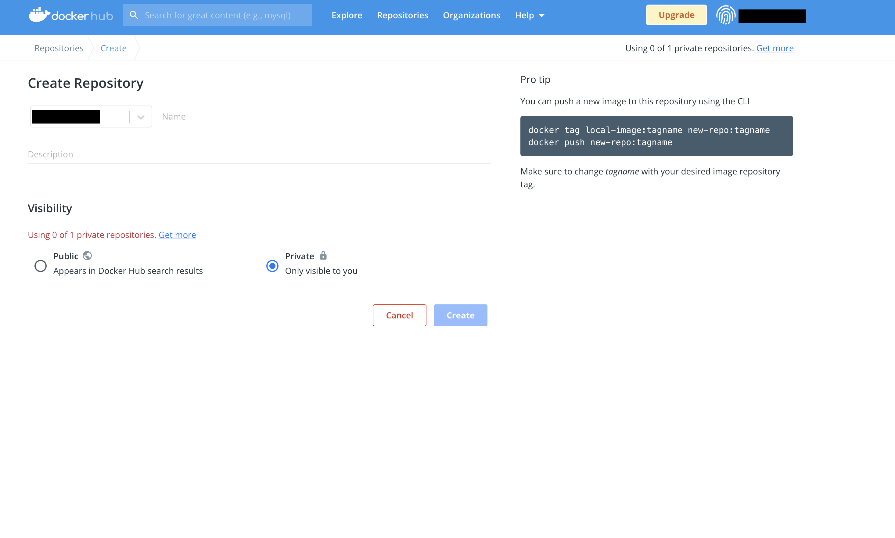

# Deployment 2.0: Canaries with KServe
In this tutorial, we will build on our previous deployment tutorial, augmenting our cluster with an ingress and adding the ability to conduct canary deployments.

When we deploy ML models, we are often unsure of the performance of our model in the real world. Methods like A/B testing and canary deployments allow us to evaluate the performance of our model and avoid erroneous deployments where the model is not performing as expected. This is done by splitting traffic between two ML services, typically your *baseline* model and a new model. As you become confident in the newly deployed service, you can increase the traffic to the new model and gradually reduce the traffic to the baseline model. This ensures a smooth deployment to your users with a little downtime and interruption as possible.

We are going to use two core technologies to implement canary deployments, [Istio](https://istio.io) and [KServe](https://kserve.github.io/website/0.9/). Briefly, Istio is a service mesh that will supply an ingress controller, while KServe is a service that will create deployments on our K8s cluster serve our models through Istio. It is worth noting that you could use [Ambassador](https://www.getambassador.io) as your ingress controller instead of Istio, but we ran into issues with Ambassador so use at your discretion!

Prerequisites:
- Previous Deployment Tut
- Install BentoML
- Install Minikube

By the end of this tutorial you will be able to:
- Setup Istio for ingress
- Setup KServe
- Run a Canary Deployment with KServe
  
This tutorial assumes you have done the [previous tutorial](https://hippocampus.podia.com/view/courses/build-an-end-to-end-production-grade-fraud-predictor/1462864-deploying-with-bentoml-on-kubernetes) on [BentoML](https://www.bentoml.com) and Kubernetes. We will again be using [minikube](https://minikube.sigs.k8s.io/docs/). If you wish to use a managed cloud cluster go for it, though you will need to pay for additional resources for Istio (it requires at least 4GB RAM)! You should have it already if you have done previous tuts, but you can download the data required for this tutorial from [here](https://drive.google.com/file/d/1MidRYkLdAV-i0qytvsflIcKitK4atiAd/view?usp=sharing). This is originally from a [Kaggle dataset](https://www.kaggle.com/competitions/ieee-fraud-detection/data) for Fraud Detection. Place this dataset in a `data` directory in the root of your project.

## Istio Ingress Setup
Firstly, we need to setup Istio for ingress. Ingress ias an API object which provides routing rules to manage both internal and external access to services in a Kubernetes cluster, acting as a single access source. We will utilise Istio as out ingress object to provide this functionality. In turn, KServe will utilize Istio to ensure that our traffic is rooted to the appropriate pods through the same endpoint. This process is pretty simple. Firstly, we need to start our minikube cluster. minikube will need extra resources for Istio, at least 4GB and 2 CPUs, so you may need to delete your old cluster first with `minikube delete`. Alternatively, you could try alter the resources assigned to your current cluster. Here, we start our cluster with 12GB of RAM and 4 CPUs.
```bash
minikube start --memory 12576 --cpus 4
```

You may need to go through specific platform setup if you don't want to use minikube, so consult the relevant guide [here](https://istio.io/latest/docs/setup/platform-setup/). We provide 2 install methods, though you should stick with the first if you don't use [helm](https://helm.sh). You must note that should you choose to use something other than minikube, you will need to setup a load balancer in your cluster, so that you can access the gateway that Istio creates. minikube provides `minikube-tunnel`, which allows *127.0.0.1* access to the gateway.

### Main Install: `istioctl` install
The recommended way to setup Istio is to use the [istioctl](https://istio.io/latest/docs/setup/quick-start.html) command line tool.
We will use the following command to install for macOS, but obviously use the relevant install method for your platform. You can read the docs [here](https://istio.io/latest/docs/setup/install/istioctl/#prerequisites).

```bash
brew install istioctl
```

Installation should now be as simple as running the install command.
```bash
istioctl install -y
```

### Alternative Install: Helm
If you are accustomed to using Helm, you can use the following commands to install Istio. Note, this is in **alpha**, so you may encounter issues.

Add the Istio repo and install the core charts.
```bash
# Add Istio Repo
helm repo add istio https://istio-release.storage.googleapis.com/charts
helm repo update

# Create Namespace
kubectl create namespace istio-system

# Install base chart
helm install istio-base istio/base -n istio-system

# Install discovery chart
helm install istiod istio/istiod -n istio-system --wait
```

Now, let's add the ingress controller.
```bash
# Install ingress chart
kubectl create namespace istio-ingress
kubectl label namespace istio-ingress istio-injection=enabled
helm install istio-ingress istio/gateway -n istio-ingress --wait
```

Finally, add a gateway!
```bash
kubectl apply -f - << END
apiVersion: networking.istio.io/v1alpha3
kind: Gateway
metadata:
  name: kserve-gateway
  namespace: istio-system
spec:
  selector:
    istio: ingressgateway # use istio default controller
  servers:
  - port:
      number: 80
      name: http
      protocol: HTTP
    hosts:
    - "*"
END
```

## KServe Setup
KServe is a service that will create ML deployments on our K8s cluster and provide the ability to conduct canary deployments. Like BentoML, KServe is model and framework agnostic. While we use Bento service containers here, with KServe you can use raw model files and simply point to the URI where the model is located if that suits your use case better. Alternatively, there are a couple of other services we can use to manage our ML deployments. Check them out if you are interested.
- [Cortex](https://www.cortex.dev) - Cortex is a tool that allows you to manage your ML deployments easily via CLI. It is AWS only, but it is a great choice if you are using the AWS EKS stack.
- [Seldon Core](https://www.seldon.io/solutions/open-source-projects/core) - Very similar to KServe, Seldon Core is a Kubernetes-only service that allows you to manage your ML deployments. Seldon Core is slightly more feature rich, but is a more complex tool to setup and use. However, compatibility with BentoML 1.0 in its current state is limited, as the framework is built as the backbone for their proprietary platform Seldon Deploy.

[cert-manager](https://cert-manager.io/) is a service that allows us to easily manage TLS certificates. It is a required dependency for KServe. Install it before proceeding.
```bash
kubectl apply -f https://github.com/cert-manager/cert-manager/releases/download/v1.9.1/cert-manager.yaml
```

### Install KNative
We are using the serverless capability for KServe, so we need to install the KNative runtime. Install the CRDs and core component charts.
```bash
kubectl apply -f https://github.com/knative/serving/releases/download/knative-v1.6.0/serving-crds.yaml
kubectl apply -f https://github.com/knative/serving/releases/download/knative-v1.6.0/serving-core.yaml
```

There is a controller that KNative uses to integrate with Istio. Install the controller next.
```bash
kubectl apply -f https://github.com/knative/net-istio/releases/download/knative-v1.6.0/net-istio.yaml
```

Finally, install the component that integrates with cert-manager.
```bash
kubectl apply -f https://github.com/knative/net-certmanager/releases/download/knative-v1.6.0/release.yaml
```

### Install KServe

Using `kubectl`, let's install the core manifest. 
```bash
kubectl apply -f https://github.com/kserve/kserve/releases/download/v0.9.0/kserve.yaml
```

There are also default serving runtimes which are necessary for KServe to function.
```bash
kubectl apply -f https://github.com/kserve/kserve/releases/download/v0.9.0/kserve-runtimes.yaml
```

For a sanity check, let's see if all the services are running.
```bash
kubectl get pods -A
```

OUTPUT:
```
NAMESPACE         NAME                                          READY   STATUS    RESTARTS   AGE
cert-manager      cert-manager-5dd59d9d9b-sjnpx                 1/1     Running   0          11m
cert-manager      cert-manager-cainjector-8696fc9f89-q2wmq      1/1     Running   0          11m
cert-manager      cert-manager-webhook-7d4b5b8c56-vq765         1/1     Running   0          11m
istio-system      istio-ingressgateway-6dbb44ff8d-r7nqk         1/1     Running   0          14m
istio-system      istiod-6b5bb85ffb-lxxsk                       1/1     Running   0          14m
knative-serving   activator-c7d578d94-sj6pz                     1/1     Running   0          11m
knative-serving   autoscaler-6488988457-qnjq6                   1/1     Running   0          11m
knative-serving   controller-6cff4c9d57-vkrg2                   1/1     Running   0          11m
knative-serving   domain-mapping-7598c5f659-d7pj7               1/1     Running   0          11m
knative-serving   domainmapping-webhook-8c4c9fdc4-6hz24         1/1     Running   0          11m
knative-serving   net-certmanager-controller-56f7f6c7c8-rwjvm   1/1     Running   0          11m
knative-serving   net-certmanager-webhook-845954c5bc-kwntl      1/1     Running   0          11m
knative-serving   net-istio-controller-7d44658469-qs2b6         1/1     Running   0          11m
knative-serving   net-istio-webhook-f5ccb98cf-wwbn7             1/1     Running   0          11m
knative-serving   webhook-df8844f6-7g8v5                        1/1     Running   0          11m
kserve            kserve-controller-manager-866557d974-djjkm    2/2     Running   0          11m
kube-system       coredns-6d4b75cb6d-kjwfr                      1/1     Running   0          15m
kube-system       etcd-minikube                                 1/1     Running   0          15m
kube-system       kube-apiserver-minikube                       1/1     Running   0          15m
kube-system       kube-controller-manager-minikube              1/1     Running   0          15m
kube-system       kube-proxy-w2hld                              1/1     Running   0          15m
kube-system       kube-scheduler-minikube                       1/1     Running   0          15m
kube-system       storage-provisioner                           1/1     Running   0          15m
```
## Creating our Bentos

We're gonna need some images to deploy. We have supplied a training file `train.py` that will train 2 models and save them to your BentoML store.
```bash
python train.py
```

There is also a `bentofile.yaml` which we can use to build the two Bentos into a service. You will need to run `bento build` twice, modifying the `fraud_detection_service.py` file to use the correct model. You can do so by changing the `model_type` variable in `train.py`. Note the tags of each Bento.

```python
#### ... in fraud_detection_service.py
model_type = "xgb"
# model_type = "rf" # Uncomment this
```
```bash
bento build
# Change model_type to rf after first build
bento build
```

Let's containerize them now using the correct Bento tags and tag them with their respective model names. Typically, before you containerize for minikube, you should point docker to minikube's docker daemon. However, we will be using dockerhub to host our images for this tutorial.
```bash
bentoml containerize fraud_classifier:<xgb-tag> -t fraud-classifier:xgb
bentoml containerize fraud_classifier:<rf-tag> -t fraud-classifier:rf
```

## Deployment with KServe


**Currently, KServe is experiencing a bug with loading local images. For now, we will solely use [Dockerhub](https://hub.docker.com) as an alternative, so create a free account. To give you an idea of how to set it up, we will be using a *private* repo. If you are already using your one free private repo, feel free to use a public one instead.**

### Setup your Dockerhub repo
Once you've created your account, navigate to the *Create Repository* page.
.
Name the repository `fraud-classifier`, and select the **Private** option (You can also select **Public** if you want).

We should create a separate namespace for our deployments. We've named it `kserve-deployments`, but name it whatever you like.
```bash
kubectl create namespace kserve-deployments
```

Next, tag the images you created with your private repo, and push them to the registry. You may need to login first with `docker login`.
```bash
docker tag fraud-classifier:xgb <dockerhub-username>/fraud-classifier:xgb
docker push <dockerhub-username>/fraud-classifier:xgb

docker tag fraud-classifier:rf <dockerhub-username>/fraud-classifier:rf
docker push <dockerhub-username>/fraud-classifier:rf
```

If you've selected **Public**, you can skip to the next section. Otherwise, you will need to create a `imagePullSecrets` object on your cluster. This is a secret that contains the parameters necessary to authenticate with Dockerhub. Name this secret `dockerhub-registry` and put it in the newly created namespace.
```bash
kubectl create secret docker-registry dockerhub-registry \
  --docker-server=https://index.docker.io/v1/ \
  --docker-email=<dockerhub-email> \
  --docker-username=<dockerhub-user> \
  --docker-password=<dockerhub-password>
  -n kserve-deployments
```

Check that your secret was created correctly.
```bash
kubectl get secret dockerhub-registry --output="jsonpath={.data.\.dockerconfigjson}"  -n kserve-deployments | base64 --decode
```

There are now two options for deploying our images in the private repo. The first is to add the `imagePullSecrets` object to the deployment under the spec. The second is to patch the a service account to always the `imagePullSecrets` object to any manifest deployed in the *kserve-deployments* namespace. We are going to do the latter and patch the default service account.
```bash
kubectl patch serviceaccount default -p "{\"imagePullSecrets\": [{\"name\": \"dockerhub-registry\"}]}" -n kserve-deployments
```

### Deploy the KServe manifest

Before we deploy a KServe manifest, let's go through the benefits of using KServe. Apart from allowing us to conduct Canary deployments, KServe gives us a number of tools to use to manage our deployments. Whether you need such functionality will largely depend on how mature your organization is and how much scalability you require with regards to machine learning services. We do recommended running Canaries at all levels of scale apart from your initial rollout, which is our main motivation behind this tut, but here are some of the other things KServe offers:
- *ModelMesh* - In cases where you frequently need to change which model to use for a given situation, ModelMesh is a great tool to use. The system will switch between models automatically without having to redeploy, ensuring you will use the best model for the current available computation to maximize responsiveness to users.
- *Pre/Post Processing Inference Graph* -  KServe allows you to specify an Inference Graph to build inference pipelines. Within the graph, you can define pre and post processing steps, traffic splits, model ensembles and model switching based on defined conditions. You can read more about how this works [here](https://kserve.github.io/website/0.9/modelserving/inference_graph/).
- *Model Monitoring & Explainability* - KServe has built-in integration with both [Alibi Detect](https://kserve.github.io/website/0.9/modelserving/detect/alibi_detect/alibi_detect/) and [Alibi Explain](https://kserve.github.io/website/0.9/modelserving/explainer/explainer/). This enables outlier and drift detection easily, as well as a black-box model for explainability. We will cover these specific services in a future version of this tutorial.

To initially deploy, we're going to create a special kind of Kubernetes deployment called a **InferenceService**. This specific resource allows us to add a `predictor` field to our manifest. This field is a spec used to specify the ML model to use for a given request and how much traffic should be routed to the service. 

Create a file called `deployment_xgb.yaml` and add the following to it:
```yaml
apiVersion: serving.kserve.io/v1beta1
kind: InferenceService
metadata:
  labels:
    app: kserve
  name: fraud-detection
  namespace: kserve-deployments
...
```
These are usual fields that you fill out for a Kubernetes deployment. Note the kind of deployment is `InferenceService`.

Now let's add the spec block. This is where we specify the ML models to use for a given request. This is done under the `predictor` field. Within this spec, we specify the docker image to use under `containers`. KServe allows you to serve specific model files too. For example, instead of `containers` we could instead specify a `sklearn` field to serve a pickled sklearn model instead (You can see an example [here](https://kserve.github.io/website/get_started/first_isvc/)).

```yaml
... # in deployment_xgb.yaml
spec:
  predictor:
    containers:
      - image: fraud-classifier:xgb
        imagePullPolicy: IfNotPresent
        name: xgb
        env:
          - name: VERSION
            value: "XGBoost"
        ports:
        - containerPort: 3000
        securityContext:
          runAsUser: 1034
```

We can deploy now deploy our manifest with `kubectl`.
```bash
kubectl apply -f deployment_xgb.yaml
```

This should take about a minute to fully deploy. You can check that status of the InferenceService by running:
```bash
kubectl get isvc fraud-classifier -n kserve-deployments
```
If the status is still `Unknown`, you can check the KNative revision was created correctly by running:
```bash
kubectl get revision $(kubectl get configuration fraud-classifier-predictor-default --output jsonpath="{.status.latestCreatedRevisionName}" -n kserve-deployments) -n kserve-deployments
```

Great, we have created our first deployment with KServe! We'll need to make a request to ensure it's working correctly. In a separate terminal, run the following command:
```bash
minikube tunnel
```

Check that the `istio-ingressgateway` service has been assigned an external IP address of `127.0.0.1`.
```bash
kubectl get svc -n istio-system
```

You can make a request similarly to the previous tut with a POST to the `/fraud-classifier` method, except now we make it the Istio gateway on `127.0.0.1`! Let's do a simple request with `curl`. Note the included header for the service hostname. This is necessary for the request to be routed to the InferenceService by KServe.
```bash
export SERVICE_HOSTNAME=$(kubectl get inferenceservice fraud-classifier -n kserve-deployments -o jsonpath='{.status.url}' | cut -d "/" -f 3)
curl -v http://127.0.0.1/fraud-classifier -H "Host: $SERVICE_HOSTNAME" -d '[{"isFraud":0, "TransactionAmt":495.0,"ProductCD":"W","card4":"visa","P_emaildomain":"live.com","R_emaildomain":null,"M1":"T","M2":"T","M3":"T"}]'
```
If all went well, the response body should output `[1]`.

## Canary Deployment
Canary deployments are a way to progressively rollout your new models to a subset of users, monitoring the performance of your newly deployed model versus the original baseline. They work by deploying two or more versions of your model, routing some traffic to the baseline and the rest to the other. As you become more confident in the new model, you can increase traffic to the new service and eventually switch to it entirely. This is a great way to ensure the new model is performing as expected, while also monitoring the service for any potential errors.

Let's add a canary deployment. Duplicate your `deployment_xgb.yaml` file and rename it `deployment_canary.yaml`. In the new file, rename the `name` field to `rf` and change the image pulled to `fraud-classifier:rf`, as such. You'll notice we have specified a new field in our predictor for `canaryTrafficPercent`. This field is used to specify the percentage of traffic that should be routed to the new canary service.

```yaml
... # in deployment_canary.yaml
spec:
  predictor:
    canaryTrafficPercent: 20
    containers:
      - image: fraud-classifier:rf
        imagePullPolicy: IfNotPresent
        name: rf
        env:
          - name: VERSION
            value: "RandomForest"
        ports:
        - containerPort: 3000
        securityContext:
          runAsUser: 1034
```

Adding the canary deployment is now just matter of applying the new deployment file!

```bash
kubectl apply -f deployment_canary.yaml -n kserve-deployments
```

Let's check the canary deployed correctly. First, we'll check the InferenceService status.
```bash
kubectl get isvc fraud-classifier -n kserve-deployments
```
You'll notice `LATESTREADYREVISION` has now updated. Furthermore, you'll also notice now that there are numbers under `PREV` and `LATEST` fields. This indicates the amount of traffic in percent going to the *previous* and *latest* revision respectively. `PREV` should be set to 80% and `LATEST` should be set to 20%.

For a further check, grab all the pods in the `kserve-deployments` namespace. You'll notice that there are now two pods for *fraud-classifier*, one for each predictor revision.
```bash
kubectl get pods -n kserve-deployments
```

To demonstrate how this works we have supplied a file, `test_requests.py`, that will make 100 requests to the deployed service. We have chosen an example such that the XGBoost model will output `[1]` and the Random Forest model will output `[0]`. Run the file.

```bash
python test_requests.py
```
OUTPUT:
```
78% to the XGB Model, 22% to the RF Model
```

You'll notice that roughly 80% of the requests were routed to the XGBoost model and 20% to the Random Forest model. Let's update our canary deployment to increase the traffic to the new model. Simply change the `canaryTrafficPercent` field to `50`.
```yaml
... # in deployment_canary.yaml
spec:
  predictor:
    canaryTrafficPercent: 20
...
```

Deploying is as easy as applying the manifest again. You can confirm the new splits by running the previous `kubectl get` commands.
```bash
kubectl apply -f deployment_canary.yaml -n kserve-deployments
```

Wait a minute for the canary to be deployed, then rerun `test_requests.py`. The split should be roughly 50/50 now!

OUTPUT:
```
51% to the XGB Model, 49% to the RF Model
```

In production, if you wish to promote the new model fully, just remove `canaryTrafficPercent` from the predictor manifest and reapply once again. Let's do that now.
```yaml
... # in deployment_canary.yaml
spec:
  predictor:
    containers:
      - image: fraud-classifier:rf
        imagePullPolicy: IfNotPresent
        name: rf
        env:
          - name: VERSION
            value: "RandomForest"
        ports:
        - containerPort: 3000
        securityContext:
          runAsUser: 1034
```
Apply the manifest again.
```bash
kubectl apply -f deployment_canary.yaml -n kserve-deployments
```

If you run the previous `kubectl get isvc` command, you'll see that there is now only single revision, `fraud-classifier-predictor-default-00002`. Run the `test_requests.py` file one last time, for a sanity check.

OUTPUT:
```
0% to the XGB Model, 100% to the RF Model
```

Congratulations! You're now able to use canary deployments to promote your new models!